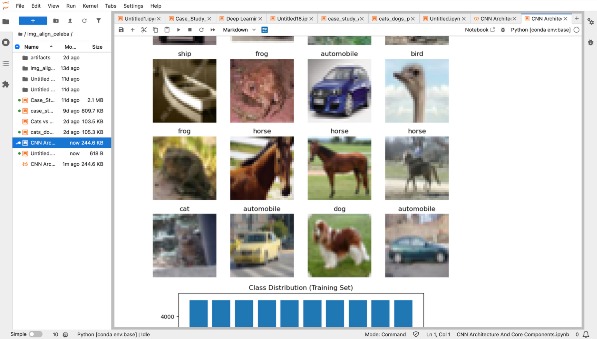
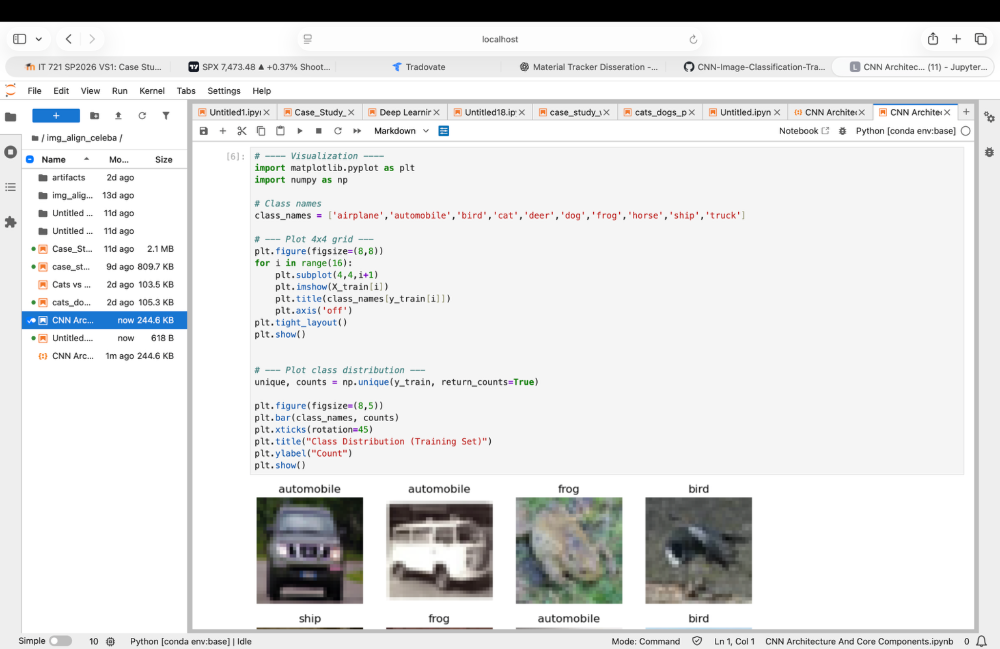
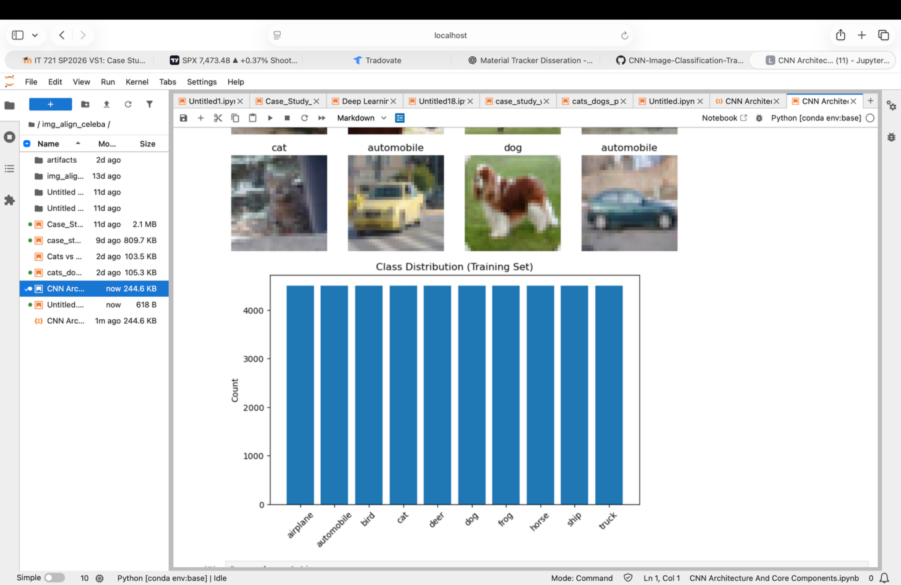

# Transfer Learning-Based Computer Vision Classification System

## Overview
This project demonstrates the development of a deep learning computer vision system using Convolutional Neural Networks (CNNs) and transfer learning techniques for binary image classification. The model was designed to classify images into two categories while leveraging pretrained neural network architectures to improve accuracy, reduce training time, and enhance generalization performance.

The project explores foundational and advanced deep learning concepts including:
- Convolutional Neural Networks (CNNs)
- Transfer Learning
- Image Augmentation
- Model Optimization
- Overfitting Prevention
- Performance Evaluation
- Predictive Image Classification

---

## Business Problem
Image classification systems are widely used across industries including:
- Healthcare diagnostics
- Manufacturing quality assurance
- Autonomous systems
- Security systems
- Retail automation
- Biotech imaging workflows

This project demonstrates how transfer learning can significantly improve model efficiency and predictive performance when working with limited datasets.

---

## Objectives
The primary objectives of this project were to:

- Build a CNN-based image classification pipeline
- Implement transfer learning using pretrained architectures
- Improve classification performance through augmentation techniques
- Evaluate model performance using deep learning metrics
- Analyze training and validation behavior
- Develop a scalable computer vision workflow

---

## Technologies Used

### Programming Language
- Python

### Deep Learning Libraries
- TensorFlow
- Keras

### Data Science Libraries
- NumPy
- Pandas
- Matplotlib
- Scikit-learn

---

## Model Architecture
The project utilizes:
- Convolutional layers
- Pooling layers
- Dense neural network layers
- Dropout regularization
- Transfer learning architectures

Transfer learning allows pretrained feature extraction layers to accelerate learning while improving model performance on smaller datasets.

---

## Deep Learning Workflow

1. Data preprocessing
2. Image augmentation
3. Dataset splitting
4. CNN model development
5. Transfer learning integration
6. Model training
7. Performance evaluation
8. Visualization and analysis

---

## Performance Metrics
Model performance was evaluated using:
- Accuracy
- Loss
- Validation Accuracy
- Validation Loss
- Confusion Matrix
- Precision
- Recall
- F1-Score

---

## Results

The transfer learning-based CNN model successfully learned image classification patterns across multiple object categories. The model demonstrated improved validation performance through convolutional feature extraction, augmentation strategies, and regularization techniques.

Key outcomes included:
- Improved classification accuracy using transfer learning
- Reduced overfitting through dropout regularization
- Balanced dataset representation
- Efficient feature extraction using pretrained architectures
- Successful image pattern recognition across multiple classes

The project demonstrates how deep learning workflows can be scaled for real-world computer vision applications in healthcare, biotech, manufacturing, and automation systems.

---

### Final Model Performance
Attention CNN Test Loss: 1.276215672492981
Attention CNN Test Accuracy: 0.5662000179290771
Training Accuracy: 63.11%
Validation Accuracy: 55.76%
Test Accuracy: 56.62%

---

## Installation & Execution

Clone repository:

```bash
git clone https://github.com/Dare215/CNN-Image-Classification-Transfer-Learning.git
```

Install dependencies:

```bash
pip install -r requirements.txt
```

Run notebook:

```bash
jupyter notebook
```
---

## Future Improvements

Future enhancements may include:
- Hyperparameter optimization
- Additional transfer learning architectures
- GPU optimization
- Model deployment using Streamlit or Flask
- Real-time image inference pipelines
- Integration with biomedical imaging datasets
- Explainable AI (XAI) visualization methods
---

## Repository Structure

```text
CNN-Image-Classification-Transfer-Learning/
│
├── notebooks/
├── visuals/
├── data/
├── README.md
└── requirements.txt
```
---

## Visualizations

### Sample Dataset Images


### Dataset Visualization


### Class Distribution

---

## Author
### Darious Brown
PhD Candidate — Artificial Intelligence & Machine Learning

Areas of Interest:
- Deep Learning
- Predictive Analytics
- Computer Vision
- Biotech AI Applications
- AI-Driven Operational Intelligence

Portfolio:
https://dare215.github.io/DariousBrown-Portfolio/

LinkedIn:
https://www.linkedin.com/in/dariousbrown
